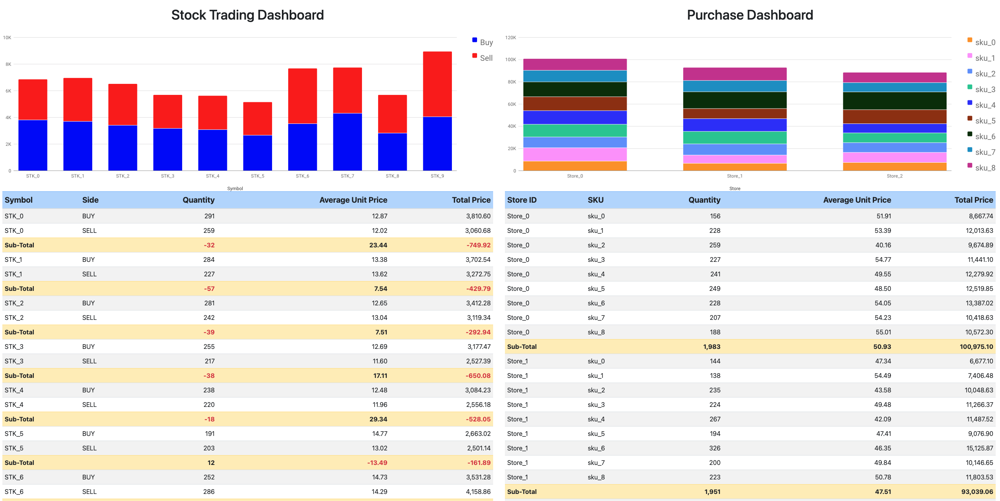

# Kafka to Parquet
This is a very basic and rudimentary python Kafka consumer to batch topic data (Avro serialised) and dump to [Apache Parquet](https://parquet.apache.org/) files (one table per topic).

Parquet files will be saved under the folder `data/` as `database_EPOCH/`.

## Requirements
- [curl](https://curl.se/)
- [DuckDB](https://duckdb.org/)
- [Docker Desktop](https://www.docker.com/products/docker-desktop/)
- [Python 3.8+](https://www.python.org/)
- Create Python virtual environment: `python3 -m venv .venv`
- Activate Python virtual environment: `source .venv/bin/activate`
- Install python requirements: `python3 -m pip install -r requirements.txt`
- Deactivate Python virtual environment: `deactivate`

## Demo Diagram
- Data will be produced by two [DataGen source connectors](https://docs.confluent.io/kafka-connectors/datagen/current/overview.html):
  - datagen_stock_trade: e.g. `{"side": "BUY", "quantity": 4, "symbol": "STK_9", "price": 8.187322875120408, "account": "Account_63", "userid": "User_60"}`
  - datagen_purchase: e.g. `{"quantity": 8, "sku": "sku_3", "price": 53.5951224569137, "storeid": "Store_0"}`
- Python consumer `kafka_to_parquet.py` will batch events (in lots of 200 by default) and dump to Parquet files (one table per topic)
  - Table Schemas:
    - stock_trade: `CREATE TABLE stock_trade(__ts TIMESTAMP, __key VARCHAR, side VARCHAR, quantity INTEGER, symbol VARCHAR, price DOUBLE, account VARCHAR, userid VARCHAR);`
    - purchase: `CREATE TABLE purchase(__ts TIMESTAMP, __key VARCHAR, quantity INTEGER, sku VARCHAR, price DOUBLE, storeid VARCHAR);`
- Python script `data_analytics.py` will load the Parquet files and generate analytics dashboard


## Kafka to Parquet Python script
```
usage: kafka_to_parquet.py [-h]
                           [--topics TOPIC [TOPIC ...]]
                           [--offset-reset {earliest,latest}]
                           [--config-filename CONFIG_FILENAME]
                           [--kafka-section KAFKA_SECTION]
                           [--sr-section SR_SECTION]
                           [--group-id GROUP_ID]
                           [--client-id CLIENT_ID]
                           [--dump-records DUMP_RECORDS]
                           [--dump-timeout DUMP_TIMEOUT]
                           [-d | --delete]

Python Kafka to Parquet (Avro serialised topics)

options:
  -h, --help            show this help message and exit
  --topics TOPIC [TOPIC ...]
                        List of topic names
  --offset-reset {earliest,latest}
                        Set auto.offset.reset (default: earliest)
  --config-filename CONFIG_FILENAME
                        Select config filename for additional configuration, such as credentials (files must be inside the folder config/)
  --kafka-section KAFKA_SECTION
                        Section in the config file related to the Kafka cluster (default is 'kafka')
  --sr-section SR_SECTION
                        Section in the config file related to the Schema Registry (default is 'schema-registry')
  --group-id GROUP_ID   Consumer's Group ID (default is 'parquet-demo')
  --client-id CLIENT_ID
                        Consumer's Client ID (default is 'parquet-demo-01')
  --dump-records DUMP_RECORDS
                        Number os records to create a new Parquet file (default is 200)
  --dump-timeout DUMP_TIMEOUT
                        Record timeout to create a new Parquet file (in seconds, default is 60)
  -d, --delete          Delete all parquet files under folder 'data/' 
```

## Running the demo
To automatically setup the demo, run `./demo_start.sh`, it should take less than 2 minutes to have everything up and running.
```
 ✔ Network kafka_to_parquet_default  Created
 ✔ Container zookeeper               Started
 ✔ Container broker                  Started
 ✔ Container schema-registry         Started
 ✔ Container connect                 Started
 ✔ Container control-center          Started

Waiting Schema Registry to be ready...
Waiting Schema Registry to be ready...
Waiting Schema Registry to be ready...
Waiting Schema Registry to be ready...
Waiting Schema Registry to be ready...

Waiting Connect Cluster to be ready...
Waiting Connect Cluster to be ready...
Waiting Connect Cluster to be ready...
Waiting Connect Cluster to be ready...
Waiting Connect Cluster to be ready...
Waiting Connect Cluster to be ready...

Creating Datagen connector (Stock Trading)
HTTP/1.1 201 Created
Date: Sat, 20 Jan 2024 15:32:36 GMT
Location: http://localhost:8083/connectors/datagen_stock_trade
Content-Type: application/json
Content-Length: 1107

{"name":"datagen_stock_trade","config":{"connector.class":"io.confluent.kafka.connect.datagen.DatagenConnector","key.converter":"org.apache.kafka.connect.storage.StringConverter","kafka.topic":"stock_trade","schema.string":"{\"namespace\": \"ksql\", \"name\": \"StockTrade\", \"type\": \"record\", \"fields\": [{\"name\": \"side\", \"type\": {\"type\": \"string\", \"arg.properties\": {\"options\": [\"BUY\", \"SELL\"]}}}, {\"name\": \"quantity\", \"type\": {\"type\": \"int\", \"arg.properties\": {\"range\": {\"min\": 1, \"max\": 10}}}}, {\"name\": \"symbol\", \"type\": {\"type\": \"string\", \"arg.properties\": {\"regex\": \"STK_[0-9]\"}}}, {\"name\": \"price\", \"type\": {\"type\": \"double\", \"arg.properties\": {\"range\": {\"min\": 1, \"max\": 25}}}}, {\"name\": \"account\", \"type\": {\"type\": \"string\", \"arg.properties\": {\"regex\": \"Account_[0-9]{2}\"}}}, {\"name\": \"userid\", \"type\": {\"type\": \"string\", \"arg.properties\": {\"regex\": \"User_[0-9]{2}\"}}}]}","max.interval":"100","iterations":"10000000","tasks.max":"1","name":"datagen_stock_trade"},"tasks":[],"type":"source"}
Creating Datagen connector (Purchase)
HTTP/1.1 201 Created
Date: Sat, 20 Jan 2024 15:32:38 GMT
Location: http://localhost:8083/connectors/datagen_purchase
Content-Type: application/json
Content-Length: 867

{"name":"datagen_purchase","config":{"connector.class":"io.confluent.kafka.connect.datagen.DatagenConnector","key.converter":"org.apache.kafka.connect.storage.StringConverter","kafka.topic":"purchase","schema.string":"{\"namespace\": \"ksql\", \"name\": \"Purchase\", \"type\": \"record\", \"fields\": [{\"name\": \"quantity\", \"type\": {\"type\": \"int\", \"arg.properties\": {\"range\": {\"min\": 1, \"max\": 10}}}}, {\"name\": \"sku\", \"type\": {\"type\": \"string\", \"arg.properties\": {\"regex\": \"sku_[0-8]\"}}}, {\"name\": \"price\", \"type\": {\"type\": \"double\", \"arg.properties\": {\"range\": {\"min\": 1, \"max\": 100}}}}, {\"name\": \"storeid\", \"type\": {\"type\": \"string\", \"arg.properties\": {\"regex\": \"Store_[0-2]\"}}}]}","max.interval":"100","iterations":"10000000","tasks.max":"1","name":"datagen_purchase"},"tasks":[],"type":"source"}

Datagen connector status (Stock Trading)
{"name":"datagen_stock_trade","connector":{"state":"RUNNING","worker_id":"connect:8083"},"tasks":[{"id":0,"state":"RUNNING","worker_id":"connect:8083"}],"type":"source"}

Datagen connector status (Stock Trading)
{"name":"datagen_purchase","connector":{"state":"RUNNING","worker_id":"connect:8083"},"tasks":[{"id":0,"state":"RUNNING","worker_id":"connect:8083"}],"type":"source"}

Demo environment is ready!
Confluent Control Center -> http://localhost:9021

2024-01-20 21:39:05.488 [INFO]: Started consumer ID parquet-demo-01 (Group parquet-demo) on topic(s): stock_trade, purchase
2024-01-20 21:39:05.513 [INFO]: Received message #0 [stock_trade]: {"side": "BUY", "quantity": 7, "symbol": "STK_4", "price": 11.81881767799564, "account": "Account_03", "userid": "User_94"}
2024-01-20 21:39:05.521 [INFO]: Received message #1 [purchase]: {"quantity": 1, "sku": "sku_6", "price": 38.85996938613606, "storeid": "Store_1"}
2024-01-20 21:39:05.536 [INFO]: Received message #2 [stock_trade]: {"side": "BUY", "quantity": 9, "symbol": "STK_0", "price": 4.532209659591048, "account": "Account_69", "userid": "User_32"}
2024-01-20 21:39:05.575 [INFO]: Received message #3 [purchase]: {"quantity": 8, "sku": "sku_0", "price": 46.68821315686183, "storeid": "Store_1"}
2024-01-20 21:39:05.610 [INFO]: Received message #4 [purchase]: {"quantity": 9, "sku": "sku_2", "price": 97.35304311086166, "storeid": "Store_0"}
2024-01-20 21:39:05.618 [INFO]: Received message #5 [stock_trade]: {"side": "BUY", "quantity": 2, "symbol": "STK_5", "price": 2.763583296931099, "account": "Account_47", "userid": "User_90"}
2024-01-20 21:39:05.664 [INFO]: Received message #6 [purchase]: {"quantity": 7, "sku": "sku_1", "price": 69.47899648476796, "storeid": "Store_2"}
2024-01-20 21:39:05.711 [INFO]: Received message #7 [stock_trade]: {"side": "BUY", "quantity": 6, "symbol": "STK_5", "price": 5.793364135172536, "account": "Account_22", "userid": "User_58"}
2024-01-20 21:39:05.733 [INFO]: Received message #8 [purchase]: {"quantity": 1, "sku": "sku_6", "price": 80.67367370389891, "storeid": "Store_2"}
2024-01-20 21:39:05.786 [INFO]: Received message #9 [stock_trade]: {"side": "BUY", "quantity": 9, "symbol": "STK_5", "price": 15.756155195769303, "account": "Account_02", "userid": "User_91"}
2024-01-20 21:39:05.788 [INFO]: Received message #10 [purchase]: {"quantity": 8, "sku": "sku_3", "price": 11.453120532874372, "storeid": "Store_0"}
2024-01-20 21:39:05.805 [INFO]: Received message #11 [purchase]: {"quantity": 2, "sku": "sku_7", "price": 26.157430866303393, "storeid": "Store_2"}
2024-01-20 21:39:05.851 [INFO]: Received message #12 [stock_trade]: {"side": "BUY", "quantity": 3, "symbol": "STK_4", "price": 15.714842976648034, "account": "Account_23", "userid": "User_45"}
2024-01-20 21:39:05.877 [INFO]: Received message #13 [purchase]: {"quantity": 2, "sku": "sku_8", "price": 11.51420908765914, "storeid": "Store_1"}
2024-01-20 21:39:05.896 [INFO]: Received message #14 [stock_trade]: {"side": "BUY", "quantity": 8, "symbol": "STK_4", "price": 17.232424747011294, "account": "Account_03", "userid": "User_51"}
2024-01-20 21:39:05.916 [INFO]: Received message #15 [stock_trade]: {"side": "BUY", "quantity": 6, "symbol": "STK_2", "price": 15.008550555629007, "account": "Account_97", "userid": "User_90"}
2024-01-20 21:39:05.922 [INFO]: Received message #16 [purchase]: {"quantity": 5, "sku": "sku_0", "price": 23.849610307444497, "storeid": "Store_1"}
2024-01-20 21:39:05.945 [INFO]: Received message #17 [stock_trade]: {"side": "BUY", "quantity": 6, "symbol": "STK_8", "price": 9.002244281436695, "account": "Account_22", "userid": "User_64"}
2024-01-20 21:39:05.955 [INFO]: Received message #18 [purchase]: {"quantity": 2, "sku": "sku_3", "price": 91.22267385717569, "storeid": "Store_0"}
2024-01-20 21:39:06.028 [INFO]: Received message #19 [stock_trade]: {"side": "BUY", "quantity": 2, "symbol": "STK_9", "price": 18.410525935763577, "account": "Account_02", "userid": "User_60"}
2024-01-20 21:39:06.052 [INFO]: Received message #20 [purchase]: {"quantity": 7, "sku": "sku_0", "price": 85.61475830493836, "storeid": "Store_1"}
2024-01-20 21:39:06.122 [INFO]: Received message #21 [stock_trade]: {"side": "BUY", "quantity": 3, "symbol": "STK_2", "price": 21.818887207570878, "account": "Account_61", "userid": "User_80"}
2024-01-20 21:39:06.127 [INFO]: Received message #22 [purchase]: {"quantity": 1, "sku": "sku_1", "price": 33.47691239687347, "storeid": "Store_2"}
2024-01-20 21:39:06.144 [INFO]: Received message #23 [purchase]: {"quantity": 9, "sku": "sku_2", "price": 69.66584501670614, "storeid": "Store_2"}
2024-01-20 21:39:06.216 [INFO]: Received message #24 [stock_trade]: {"side": "SELL", "quantity": 6, "symbol": "STK_2", "price": 3.9498772783776293, "account": "Account_90", "userid": "User_21"}
2024-01-20 21:39:06.217 [INFO]: Received message #25 [purchase]: {"quantity": 8, "sku": "sku_3", "price": 91.22976064566245, "storeid": "Store_0"}
2024-01-20 21:39:06.228 [INFO]: Received message #26 [purchase]: {"quantity": 1, "sku": "sku_1", "price": 54.017359960660045, "storeid": "Store_2"}
2024-01-20 21:39:06.240 [INFO]: Received message #27 [purchase]: {"quantity": 8, "sku": "sku_6", "price": 14.219402092129709, "storeid": "Store_1"}
2024-01-20 21:39:06.246 [INFO]: Received message #28 [stock_trade]: {"side": "BUY", "quantity": 5, "symbol": "STK_0", "price": 10.139656637128954, "account": "Account_97", "userid": "User_79"}
2024-01-20 21:39:06.297 [INFO]: Received message #29 [stock_trade]: {"side": "SELL", "quantity": 6, "symbol": "STK_0", "price": 18.09842757602576, "account": "Account_54", "userid": "User_26"}
2024-01-20 21:39:06.300 [INFO]: Received message #30 [purchase]: {"quantity": 6, "sku": "sku_3", "price": 4.8025932400004505, "storeid": "Store_2"}
2024-01-20 21:39:06.319 [INFO]: Received message #31 [purchase]: {"quantity": 2, "sku": "sku_5", "price": 16.91088134799461, "storeid": "Store_1"}
2024-01-20 21:39:06.355 [INFO]: Received message #32 [purchase]: {"quantity": 2, "sku": "sku_7", "price": 55.659460543765526, "storeid": "Store_2"}
2024-01-20 21:39:06.386 [INFO]: Received message #33 [stock_trade]: {"side": "SELL", "quantity": 2, "symbol": "STK_0", "price": 16.809477543342354, "account": "Account_52", "userid": "User_63"}
2024-01-20 21:39:06.394 [INFO]: Received message #34 [purchase]: {"quantity": 2, "sku": "sku_8", "price": 54.7581800529514, "storeid": "Store_0"}
2024-01-20 21:39:06.396 [INFO]: Received message #35 [purchase]: {"quantity": 3, "sku": "sku_2", "price": 88.16621174364705, "storeid": "Store_2"}
2024-01-20 21:39:06.450 [INFO]: Received message #36 [purchase]: {"quantity": 5, "sku": "sku_7", "price": 6.568996058947247, "storeid": "Store_1"}
2024-01-20 21:39:06.461 [INFO]: Received message #37 [stock_trade]: {"side": "SELL", "quantity": 9, "symbol": "STK_8", "price": 24.805850253924426, "account": "Account_76", "userid": "User_35"}
2024-01-20 21:39:06.494 [INFO]: Received message #38 [purchase]: {"quantity": 2, "sku": "sku_8", "price": 91.33497370759761, "storeid": "Store_2"}
2024-01-20 21:39:06.506 [INFO]: Received message #39 [stock_trade]: {"side": "SELL", "quantity": 7, "symbol": "STK_9", "price": 11.941607737506613, "account": "Account_40", "userid": "User_42"}
2024-01-20 21:39:06.514 [INFO]: Received message #40 [stock_trade]: {"side": "SELL", "quantity": 7, "symbol": "STK_4", "price": 4.232341915342842, "account": "Account_75", "userid": "User_51"}
2024-01-20 21:39:06.581 [INFO]: Received message #41 [stock_trade]: {"side": "SELL", "quantity": 1, "symbol": "STK_0", "price": 23.197818648394026, "account": "Account_18", "userid": "User_28"}
2024-01-20 21:39:06.596 [INFO]: Received message #42 [purchase]: {"quantity": 5, "sku": "sku_5", "price": 23.167214403307685, "storeid": "Store_1"}
2024-01-20 21:39:06.621 [INFO]: Received message #43 [stock_trade]: {"side": "BUY", "quantity": 1, "symbol": "STK_2", "price": 23.589937680934938, "account": "Account_62", "userid": "User_00"}
2024-01-20 21:39:06.651 [INFO]: Received message #44 [purchase]: {"quantity": 7, "sku": "sku_6", "price": 32.64502202649227, "storeid": "Store_0"}
2024-01-20 21:39:06.690 [INFO]: Received message #45 [stock_trade]: {"side": "SELL", "quantity": 6, "symbol": "STK_6", "price": 10.385609462732749, "account": "Account_64", "userid": "User_96"}
2024-01-20 21:39:06.694 [INFO]: Received message #46 [purchase]: {"quantity": 1, "sku": "sku_1", "price": 86.89043753257421, "storeid": "Store_1"}
2024-01-20 21:39:06.729 [INFO]: Received message #47 [purchase]: {"quantity": 5, "sku": "sku_5", "price": 1.9840211172912252, "storeid": "Store_1"}
2024-01-20 21:39:06.782 [INFO]: Received message #48 [purchase]: {"quantity": 8, "sku": "sku_6", "price": 92.58249474055224, "storeid": "Store_1"}
2024-01-20 21:39:06.790 [INFO]: Received message #49 [stock_trade]: {"side": "BUY", "quantity": 8, "symbol": "STK_2", "price": 18.69826020719012, "account": "Account_05", "userid": "User_83"}
2024-01-20 21:39:06.855 [INFO]: Received message #50 [purchase]: {"quantity": 9, "sku": "sku_0", "price": 8.643751871508677, "storeid": "Store_2"}
2024-01-20 21:39:06.855 [INFO]: Received message #51 [stock_trade]: {"side": "SELL", "quantity": 5, "symbol": "STK_1", "price": 13.272888137300116, "account": "Account_35", "userid": "User_31"}
2024-01-20 21:39:06.891 [INFO]: Received message #52 [stock_trade]: {"side": "SELL", "quantity": 7, "symbol": "STK_9", "price": 10.605343464316128, "account": "Account_04", "userid": "User_70"}
2024-01-20 21:39:06.904 [INFO]: Received message #53 [purchase]: {"quantity": 9, "sku": "sku_5", "price": 11.221216406458021, "storeid": "Store_2"}
2024-01-20 21:39:06.940 [INFO]: Received message #54 [stock_trade]: {"side": "SELL", "quantity": 6, "symbol": "STK_6", "price": 13.981498167999536, "account": "Account_11", "userid": "User_51"}
2024-01-20 21:39:06.951 [INFO]: Received message #55 [stock_trade]: {"side": "SELL", "quantity": 4, "symbol": "STK_5", "price": 14.009262314607328, "account": "Account_49", "userid": "User_07"}
2024-01-20 21:39:06.967 [INFO]: Received message #56 [purchase]: {"quantity": 2, "sku": "sku_3", "price": 55.722576947818, "storeid": "Store_2"}
2024-01-20 21:39:06.984 [INFO]: Received message #57 [stock_trade]: {"side": "SELL", "quantity": 8, "symbol": "STK_5", "price": 10.499998881829885, "account": "Account_13", "userid": "User_07"}
2024-01-20 21:39:06.994 [INFO]: Received message #58 [stock_trade]: {"side": "SELL", "quantity": 2, "symbol": "STK_1", "price": 11.099879620095514, "account": "Account_43", "userid": "User_88"}
2024-01-20 21:39:07.030 [INFO]: Received message #59 [stock_trade]: {"side": "SELL", "quantity": 8, "symbol": "STK_2", "price": 4.602975269531755, "account": "Account_45", "userid": "User_85"}
2024-01-20 21:39:07.033 [INFO]: Received message #60 [purchase]: {"quantity": 2, "sku": "sku_6", "price": 23.756423434576803, "storeid": "Store_0"}
2024-01-20 21:39:07.055 [INFO]: Received message #61 [purchase]: {"quantity": 9, "sku": "sku_3", "price": 23.638311429006297, "storeid": "Store_0"}
2024-01-20 21:39:07.078 [INFO]: Received message #62 [purchase]: {"quantity": 6, "sku": "sku_7", "price": 70.39663599676713, "storeid": "Store_1"}
2024-01-20 21:39:07.092 [INFO]: Received message #63 [purchase]: {"quantity": 6, "sku": "sku_0", "price": 53.8265083017944, "storeid": "Store_0"}
2024-01-20 21:39:07.118 [INFO]: Received message #64 [stock_trade]: {"side": "BUY", "quantity": 2, "symbol": "STK_9", "price": 8.236728895863969, "account": "Account_42", "userid": "User_17"}
2024-01-20 21:39:07.177 [INFO]: Received message #65 [purchase]: {"quantity": 5, "sku": "sku_4", "price": 72.40218462391229, "storeid": "Store_2"}
2024-01-20 21:39:07.180 [INFO]: Received message #66 [stock_trade]: {"side": "BUY", "quantity": 3, "symbol": "STK_1", "price": 11.299946035436864, "account": "Account_83", "userid": "User_66"}
2024-01-20 21:39:07.224 [INFO]: Received message #67 [purchase]: {"quantity": 8, "sku": "sku_6", "price": 40.429175514320654, "storeid": "Store_2"}
2024-01-20 21:39:07.256 [INFO]: Received message #68 [stock_trade]: {"side": "SELL", "quantity": 7, "symbol": "STK_4", "price": 19.050580608784525, "account": "Account_31", "userid": "User_14"}
2024-01-20 21:39:07.306 [INFO]: Received message #69 [purchase]: {"quantity": 3, "sku": "sku_6", "price": 95.41208672678876, "storeid": "Store_2"}
2024-01-20 21:39:07.335 [INFO]: Received message #70 [purchase]: {"quantity": 8, "sku": "sku_6", "price": 12.48723363237643, "storeid": "Store_1"}
2024-01-20 21:39:07.350 [INFO]: Received message #71 [stock_trade]: {"side": "BUY", "quantity": 6, "symbol": "STK_3", "price": 19.819773169795305, "account": "Account_68", "userid": "User_95"}
2024-01-20 21:39:07.405 [INFO]: Received message #72 [purchase]: {"quantity": 9, "sku": "sku_6", "price": 87.14559919199853, "storeid": "Store_0"}
2024-01-20 21:39:07.416 [INFO]: Received message #73 [stock_trade]: {"side": "BUY", "quantity": 1, "symbol": "STK_5", "price": 20.984028054613376, "account": "Account_73", "userid": "User_18"}
2024-01-20 21:39:07.478 [INFO]: Received message #74 [purchase]: {"quantity": 2, "sku": "sku_2", "price": 28.23710116820206, "storeid": "Store_1"}
2024-01-20 21:39:07.481 [INFO]: Received message #75 [purchase]: {"quantity": 7, "sku": "sku_5", "price": 20.653133419785075, "storeid": "Store_2"}
2024-01-20 21:39:07.495 [INFO]: Received message #76 [purchase]: {"quantity": 6, "sku": "sku_4", "price": 5.28553071530288, "storeid": "Store_2"}
^C2024-01-20 21:39:07.511 [WARNING]: CTRL-C pressed by user!
2024-01-20 21:39:07.511 [INFO]: Closing consumer ID parquet-demo-01 (Group parquet-demo)
2024-01-20 21:39:07.511 [INFO]: Adding 77 record(s) into the database...
2024-01-20 21:39:07.523 [INFO]: Exporting data to: data/database_1705786747...
2024-01-20 21:39:07.525 [INFO]: Completed!
```

An HTML dashboard (`analytics.html`) will be created and it should be automatically open once generated (that report will refresh itself every 3 seconds):


## Stopping the demo
To stop the demo, please run `./demo_stop.sh`.
```
 ✔ Container connect                 Removed
 ✔ Container control-center          Removed
 ✔ Container schema-registry         Removed
 ✔ Container broker                  Removed
 ✔ Container zookeeper               Removed
 ✔ Network kafka_to_parquet_default  Removed 

Parquet data:
 16K    data//database_1705869645
 16K    data//database_1705869674
144K    data/

--> Delete all parquet data (y/n)? y
data/database_1705869645/schema.sql
data/database_1705869645/purchase.parquet
data/database_1705869645/load.sql
data/database_1705869645/stock_trade.parquet
data/database_1705869645
data/database_1705869674/schema.sql
data/database_1705869674/purchase.parquet
data/database_1705869674/load.sql
data/database_1705869674/stock_trade.parquet
data/database_1705869674
```

## External References
Check out [Confluent's Developer portal](https://developer.confluent.io), it has free courses, documents, articles, blogs, podcasts and so many more content to get you up and running with a fully managed Apache Kafka service.

Disclaimer: I work for Confluent :wink:
